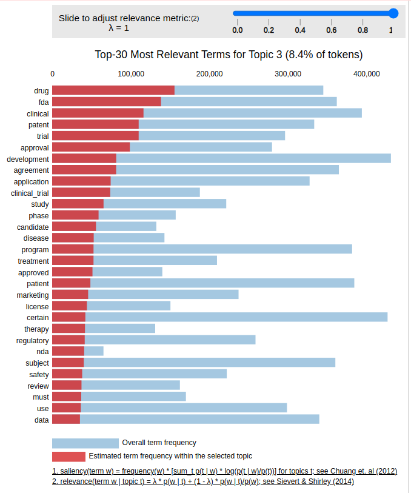
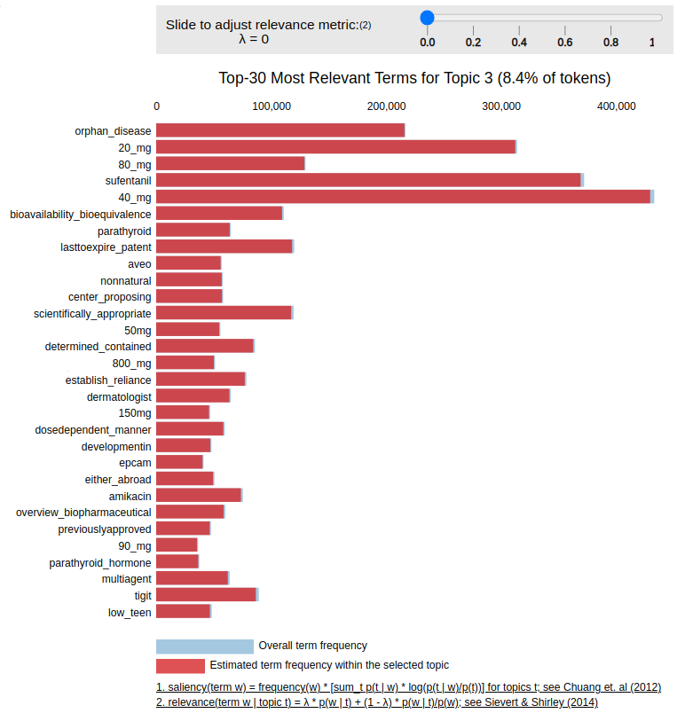
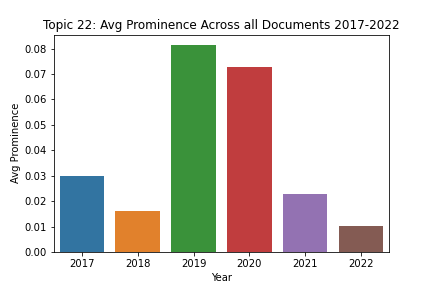
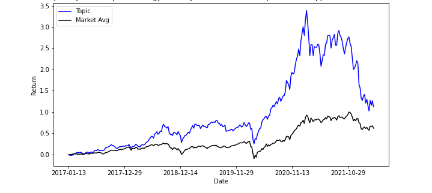
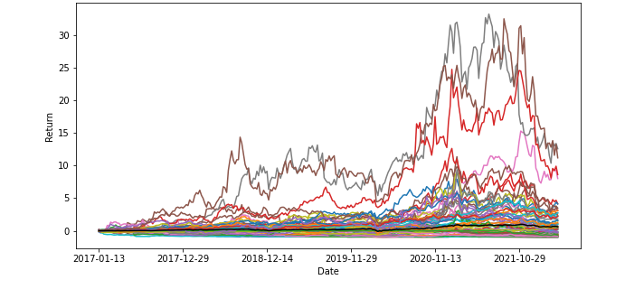

# Topic Modeling of Form 10-K SEC Data

The purpose of this project was to explore whether topic modeling could extract meaningful themes from the 10-K forms that publicly-traded companies file with the SEC every year. These 10-K forms discuss the business activities and the financial performance of a company in a given year. Using the Python package sec-api, I scraped Part 1, Item 1 from 10-K forms from 2017-2022. In Part 1, Item 1, businesses provide an overview of their operations and discuss their products and services for a given year. These descriptions had a median length of 46,333 words over the time period. Latent Dirichlet Allocation (LDA) topic modeling was performed on the 10-K forms using the gensim package in Python. The resulting topics were then matched with stock return data to identify outperforming themes.

## Visualizing the Topics

The visualization below shows an example of one of the topics identified by LDA. This topic is made up of keywords that revolve around drug development, and includes words that suggest companies that include this topic are going through clinical trials, seeking FDA-approval, or applying for patents. When lambda is 1, the visualization shows the terms that have the highest ratio of frequency of terms specific to the given topic versus the overall frequency of the entire corpus. When lambda 0, the visualization shows the terms that are most specific to the given topic. As the figure shows, when lambda is 0, the words that are contained almost entirely within this topic involve drug dosages and specific drug names. 

Topic 3: Lambda 1          |  Topic 3: Lambda 0
:-------------------------:|:-------------------------:
  |   

I was also interested in understanding if we could detect themes by identifying which topics increased in prominence over the given time period. The figure below shows how one topic increased and decreased in prominence over the time period. Each bar represents the average of the topic's contribution to all documents in the corpus, allowing us to visualize whether topics are being mentioned more or less over time. As the figure shops, topic 22 increased in prominence in the corpus from 2018 to 2019, going from contributing an average of about 1.5% to each business description in 2018 to contributing an average of 8.0% to each business description in 2019. This observation can then be linked to stock price data to see if emerging topics are correlated with increased returns. 

 

## Linking Topics to Stock Returns

After the topics were identified, every company was assigned a dominant topic for every year (i.e., a company's dominant topic could change from year to year, though most did not). The dominant topic represents the topic that the highest percentage of words in the business description contributed to. For example, the dominant topic for Chevron Corp includes the keywords: "gas, oil, property, natural, reserve, interest, well, production" and, in 2017, 69.8% of words in the business description contributed to this topic. 

Stock return charts were generated for each topic. The figure below shows an example of one outperforming topic. The figure on the left shows the average return of all businesses that had the given topic as their dominant topic at some point in the time period 2017-2022 and the figure on the right shows the individual returns of all businesses that had the given topic as their dominant topic at some point in the time period 2017-2022. 

Average Return             |  Individual Returns
:-------------------------:|:-------------------------:
  |   

Select code for this project can be found in the Jupyter notebook file here. 
